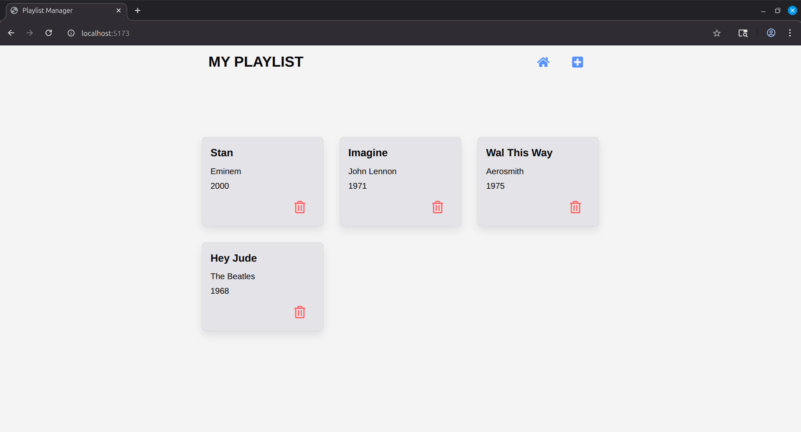
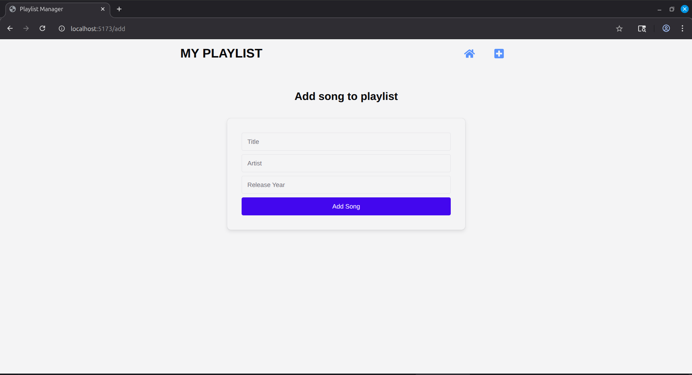

My Playlist Web App
Developed a full-stack web application that allows users to manage music playlist. The app enables users to add, view, and delete songs with a clean and responsive interface. Built with a modular architecture and RESTful API integration, the project demonstrates proficiency in modern web development practices, including state management, component-based design, and database operations.

Key Features:
	Add new songs with title, artist, and release year
	Display all songs in a card-based layout
	Delete songs with instant UI updates
	Responsive design with Chakra UI
	Centralized state management using Zustand

Technologies Used:
	Frontend: React, Vite, Chakra UI, React Router, Zustand
	Backend: Node.js, Express.js, MongoDB, Mongoose
	Tools & Libraries: REST API, JavaScript, Git